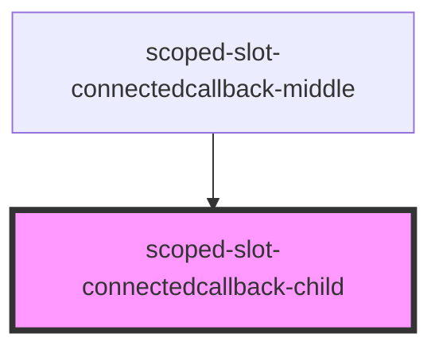
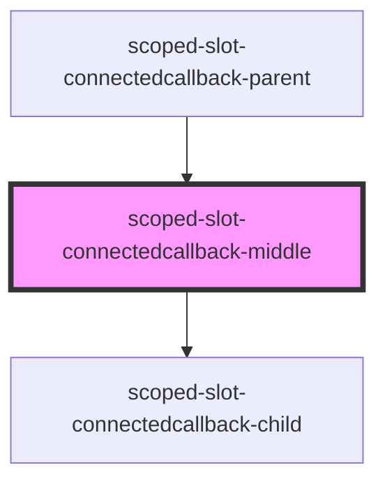
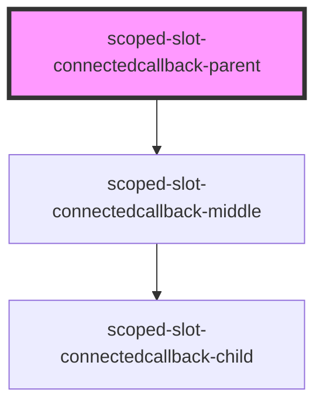

# scoped-slot-connectedcallback-parent

<!-- Auto Generated Below -->

## `scoped-slot-connectedcallback-child`

### Dependencies

### Used by

 - [scoped-slot-connectedcallback-middle](.)

### Graph

## `scoped-slot-connectedcallback-middle`

### Dependencies

### Used by

 - [scoped-slot-connectedcallback-parent](.)

### Depends on

- [scoped-slot-connectedcallback-child](.)

### Graph

## `scoped-slot-connectedcallback-parent`

### Dependencies

### Depends on

- [scoped-slot-connectedcallback-middle](.)

### Graph

----------------------------------------------

*Built with [StencilJS](https://stenciljs.com/)*
