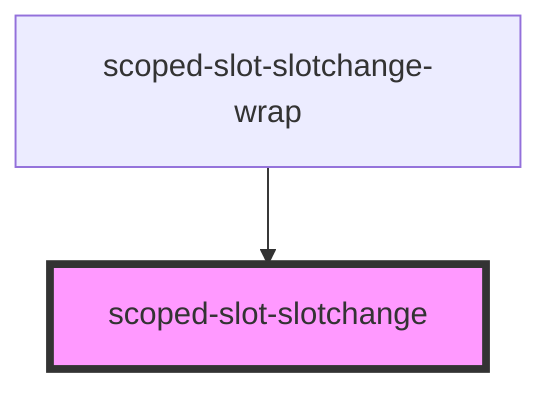
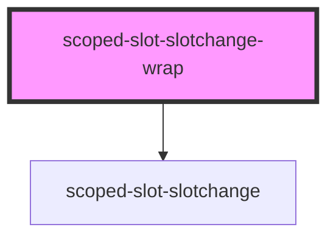

# scoped-slot-slotchange-wrap

<!-- Auto Generated Below -->

## `scoped-slot-slotchange`

### Properties

| Property         | Attribute | Description | Type                                         | Default |
| ---------------- | --------- | ----------- | -------------------------------------------- | ------- |
| `slotEventCatch` | --        |             | `{ event: Event; assignedNodes: Node[]; }[]` | `[]`    |

### Dependencies

### Used by

 - [scoped-slot-slotchange-wrap](.)

### Graph

## `scoped-slot-slotchange-wrap`

### Properties

| Property          | Attribute           | Description | Type      | Default |
| ----------------- | ------------------- | ----------- | --------- | ------- |
| `swapSlotContent` | `swap-slot-content` |             | `boolean` | `false` |

### Dependencies

### Depends on

- [scoped-slot-slotchange](.)

### Graph

----------------------------------------------

*Built with [StencilJS](https://stenciljs.com/)*
