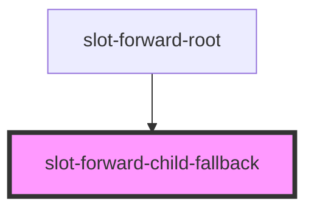
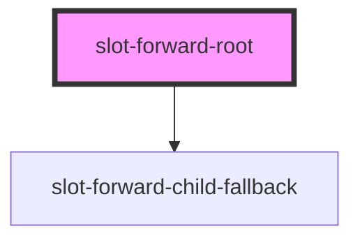

# slot-forward-root

<!-- Auto Generated Below -->

## `slot-forward-child-fallback`

### Properties

| Property | Attribute | Description | Type     | Default     |
| -------- | --------- | ----------- | -------- | ----------- |
| `label`  | `label`   |             | `string` | `undefined` |

### Dependencies

### Used by

 - [slot-forward-root](.)

### Graph

## `slot-forward-root`

### Properties

| Property | Attribute | Description | Type     | Default     |
| -------- | --------- | ----------- | -------- | ----------- |
| `label`  | `label`   |             | `string` | `undefined` |

### Dependencies

### Depends on

- [slot-forward-child-fallback](.)

### Graph

----------------------------------------------

*Built with [StencilJS](https://stenciljs.com/)*
