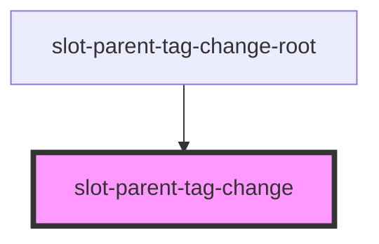
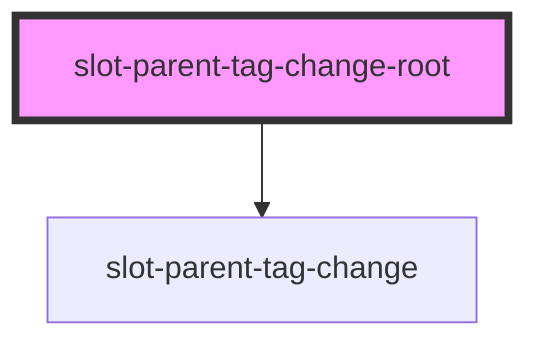

# slot-parent-tag-change-root

<!-- Auto Generated Below -->

## `slot-parent-tag-change`

### Properties

| Property  | Attribute | Description | Type     | Default |
| --------- | --------- | ----------- | -------- | ------- |
| `element` | `element` |             | `string` | `'p'`   |

### Dependencies

### Used by

 - [slot-parent-tag-change-root](.)

### Graph

## `slot-parent-tag-change-root`

### Properties

| Property  | Attribute | Description | Type     | Default |
| --------- | --------- | ----------- | -------- | ------- |
| `element` | `element` |             | `string` | `'p'`   |

### Dependencies

### Depends on

- [slot-parent-tag-change](.)

### Graph

----------------------------------------------

*Built with [StencilJS](https://stenciljs.com/)*
