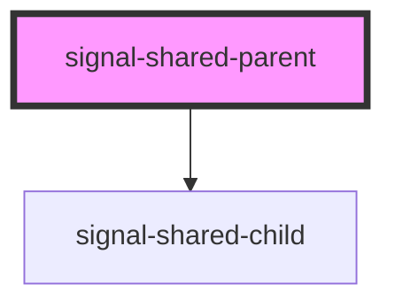

# signal-shared-parent

<!-- Auto Generated Below -->

## Methods

### `getCountSignal() => Promise<import("@preact/signals-core").Signal<number>>`

#### Returns

Type: `Promise<Signal<number>>`

### `getLabelSignal() => Promise<import("@preact/signals-core").Signal<string>>`

#### Returns

Type: `Promise<Signal<string>>`

### `setCount(n: number) => Promise<void>`

#### Parameters

| Name | Type     | Description |
| ---- | -------- | ----------- |
| `n`  | `number` |             |

#### Returns

Type: `Promise<void>`

### `setLabel(s: string) => Promise<void>`

#### Parameters

| Name | Type     | Description |
| ---- | -------- | ----------- |
| `s`  | `string` |             |

#### Returns

Type: `Promise<void>`

## Dependencies

### Depends on

- [signal-shared-child](.)

### Graph

----------------------------------------------

*Built with [StencilJS](https://stenciljs.com/)*
