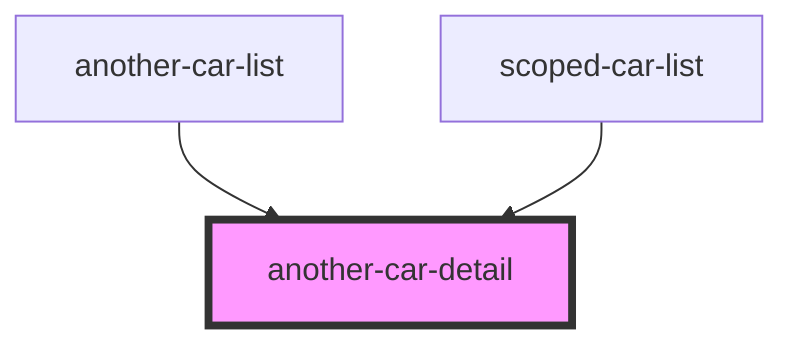

# scoped-car-detail

<!-- Auto Generated Below -->

## `another-car-detail`

### Properties

| Property | Attribute | Description | Type      | Default     |
| -------- | --------- | ----------- | --------- | ----------- |
| `car`    | `car`     |             | `CarData` | `undefined` |

### Dependencies

### Used by

 - [another-car-list](../another-car-list)
 - [scoped-car-list](../another-car-list)

### Graph

## `scoped-car-detail`

### Properties

| Property | Attribute | Description | Type      | Default     |
| -------- | --------- | ----------- | --------- | ----------- |
| `car`    | `car`     |             | `CarData` | `undefined` |

----------------------------------------------

*Built with [StencilJS](https://stenciljs.com/)*
